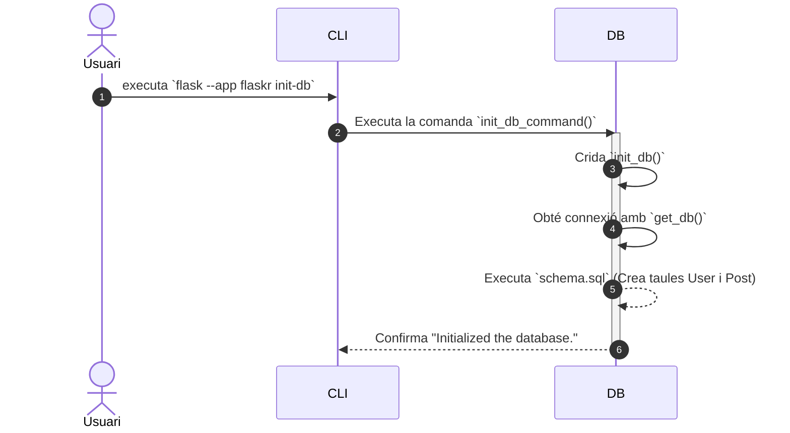
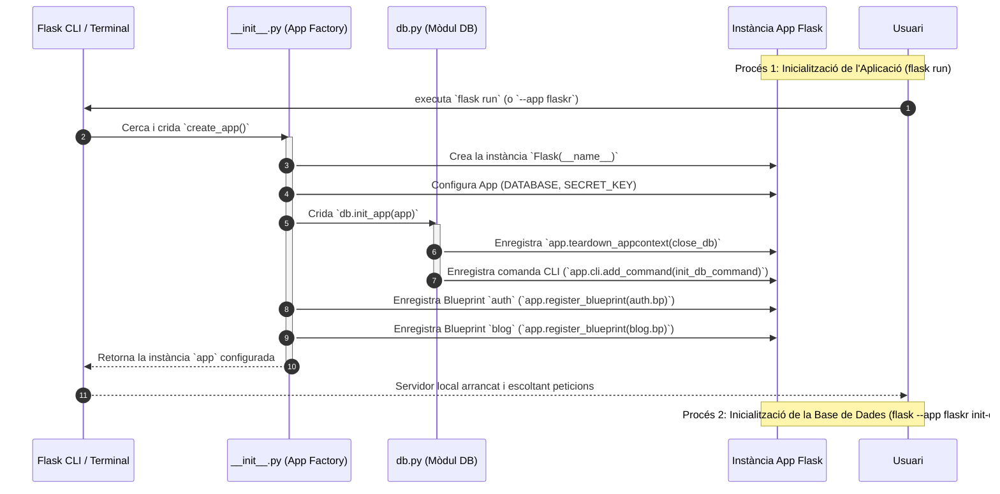
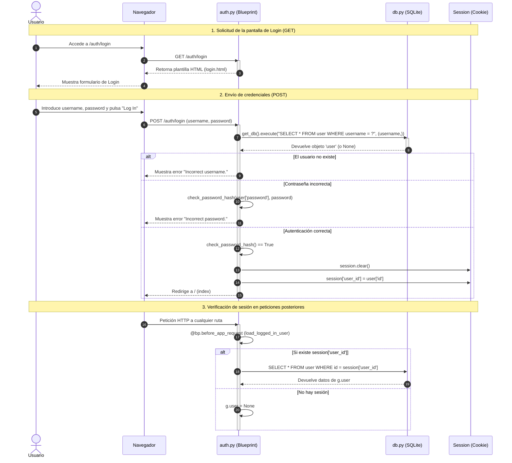

# Diagrames de seqüència

## Diagrama Init Database

```mermaid
sequenceDiagram
    autonumber
    actor Usuari
    participant CLI
    participant DB

    Usuari->>CLI: executa `flask --app flaskr init-db`
    CLI->>DB: Executa la comanda `init_db_command()`
    activate DB
    DB->>DB: Crida `init_db()`
    DB->>DB: Obté connexió amb `get_db()`
    DB-->>DB: Executa `schema.sql` (Crea taules User i Post)
    DB-->>CLI: Confirma "Initialized the database."
    deactivate DB
```
## Diagrama d'arrencada de l'aplicació

```mermaid
sequenceDiagram
    autonumber
    participant CLI as Flask CLI / Terminal
    participant Init as __init__.py (App Factory)
    participant DB as db.py (Mòdul DB)
    participant FlaskApp as Instància App Flask

    Note over Usuari, FlaskApp: Procés 1: Inicialització de l'Aplicació (flask run)
    Usuari->>CLI: executa `flask run` (o `--app flaskr`)
    CLI->>Init: Cerca i crida `create_app()`
    activate Init
    Init->>FlaskApp: Crea la instància `Flask(__name__)`
    Init->>FlaskApp: Configura App (DATABASE, SECRET_KEY)
    Init->>DB: Crida `db.init_app(app)`
    activate DB
    DB->>FlaskApp: Enregistra `app.teardown_appcontext(close_db)`
    DB->>FlaskApp: Enregistra comanda CLI (`app.cli.add_command(init_db_command)`)
    deactivate DB
    Init->>FlaskApp: Enregistra Blueprint `auth` (`app.register_blueprint(auth.bp)`)
    Init->>FlaskApp: Enregistra Blueprint `blog` (`app.register_blueprint(blog.bp)`)
    Init-->>CLI: Retorna la instància `app` configurada
    deactivate Init
    CLI-->>Usuari: Servidor local arrancat i escoltant peticions

    Note over Usuari, FlaskApp: Procés 2: Inicialització de la Base de Dades (flask --app flaskr init-db)
```

## Login

```mermaid
sequenceDiagram
    autonumber
    actor Usuario
    participant Navegador
    participant Auth as auth.py (Blueprint)
    participant DB as db.py (SQLite)
    participant Session as Session (Cookie)

    Note over Usuario, Session: 1. Solicitud de la pantalla de Login (GET)
    Usuario->>Navegador: Accede a /auth/login
    Navegador->>Auth: GET /auth/login
    activate Auth
    Auth-->>Navegador: Retorna plantilla HTML (login.html)
    deactivate Auth
    Navegador-->>Usuario: Muestra formulario de Login

    Note over Usuario, Session: 2. Envío de credenciales (POST)
    Usuario->>Navegador: Introduce username, password y pulsa "Log In"
    Navegador->>Auth: POST /auth/login (username, password)
    activate Auth

    Auth->>DB: get_db().execute("SELECT * FROM user WHERE username = ?", (username,))
    activate DB
    DB-->>Auth: Devuelve objeto 'user' (o None)
    deactivate DB

    alt El usuario no existe
        Auth-->>Navegador: Muestra error "Incorrect username."
    else Contraseña incorrecta
        Auth->>Auth: check_password_hash(user['password'], password)
        Auth-->>Navegador: Muestra error "Incorrect password."
    else Autenticación correcta
        Auth->>Auth: check_password_hash() == True
        Auth->>Session: session.clear()
        Auth->>Session: session['user_id'] = user['id']
        Auth-->>Navegador: Redirige a / (index)
    end
    deactivate Auth

    Note over Usuario, Session: 3. Verificación de sesión en peticiones posteriores
    Navegador->>Auth: Petición HTTP a cualquier ruta
    activate Auth
    Auth->>Auth: @bp.before_app_request (load_logged_in_user)
    alt Si existe session['user_id']
        Auth->>DB: SELECT * FROM user WHERE id = session['user_id']
        DB-->>Auth: Devuelve datos de g.user
    else No hay sesión
        Auth->>Auth: g.user = None
    end
    deactivate Auth
```